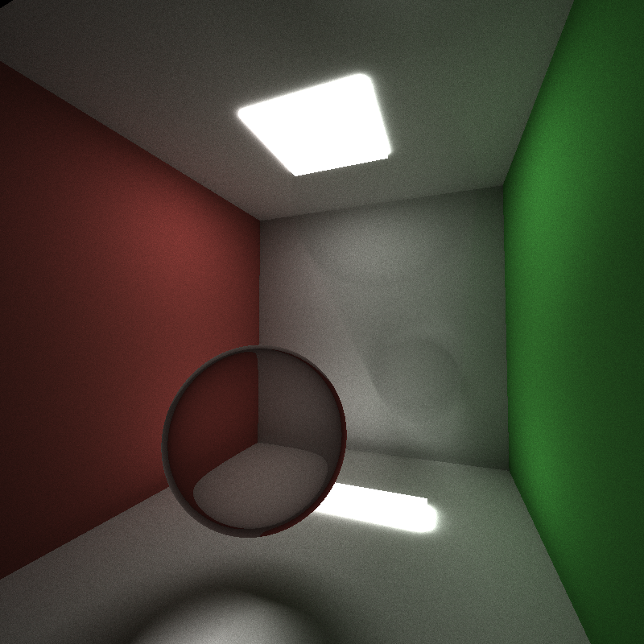

CUDA Path Tracer
================

**University of Pennsylvania, CIS 565: GPU Programming and Architecture, Project 3**

* Trung Le
* Windows 10 Home, i7-4790 CPU @ 3.60GHz 12GB, GTX 980 Ti (Person desktop)

### Stream compaction

**---- General information for CUDA device ----**
- Device name: GeForce GTX 980 Ti
- Compute capability: 5.2
- Compute mode: Default
- Clock rate: 1076000
- Integrated: 0
- Device copy overlap: Enabled
- Kernel execution timeout: Enabled
 
**---- Memory information for CUDA device ----**

- Total global memory: 6442450944
- Total constant memory: 65536
- Multiprocessor count: 22
- Shared memory per multiprocessor: 98304
- Registers per multiprocessor: 65536
- Max threads per multiprocessor: 2048
- Max grid dimensions: [2147483647, 65535, 65535]
- Max threads per block: 1024
- Max registers per block: 65536
- Max thread dimensions: [1024, 1024, 64]
- Threads per block: 512

# Description

In this project, I implemented on top of the provided CUDA started code a fully functional pathtracer with the following features:

1. Stream compaction on terminated paths during bounces
2. Diffuse shading
3. Specular reflection
4. Specular transmission / Refraction
5. Mesh support (__.obj__ format) 
6. BVH acceleration data structure with stack-less BVH traversal

### Diffuse shading

Diffuse shading is computed by bouncing the next path segment from a diffuse surface with a cosine-weighted random ray direction. The color of the bounced ray is multiplied with the original color using Lambert's law according to the [rendering equation](https://en.wikipedia.org/wiki/Rendering_equation).

### Specular reflection

Similarly, specular reflection bounces the next path segment using `glm::reflect` with the surface's normal.

### Refraction

For refraction, the next path segment's direction is computed using `glm::refract` with a given index of refraction.

From left to right:
- __[IOR - 2.5]__ Mixed 50% yellow specular reflective and 50% refractive diamond
- __[IOR - 1.5]__ Refractive water
- __[IOR - 1.62]__ Refractive crown glass
- __[IOR - 1.77]__ Refractive saphire
- __[IOR - 2.5]__ Refractive diamond

You can see the effect of different indices of refraction for each sphere.  

## Stream compaction

Light path segments that hit the light source or not hitting any objects are terminated by using stream compaction on the list of path segments. In this implementation, I used `thrust::partition` to sort the path segments that have bottomed to the right of the `dev_paths` array and those that are still bouncing to the left. At the end, all the pixel colors are computed during final gathering.

__[Analysis still required here]__

I did a quick comparison between `glm::remove_if` and `glm::partition`, and on average the `glm::remove_if` takes ~1.206ms/bounce while `glm::partion` takes ~1.759ms/bounce.

## Arbitrary mesh loading and rendering

For meshing, I used [tinyobjloader](https://github.com/syoyo/tinyobjloader) by [syoyo](https://github.com/syoyo) to parse __.obj__ format files. `Scene::loadSceneFromObj` in [`scene.cpp`](https://github.com/trungtle/Project3-CUDA-Path-Tracer/blob/master/src/scene.cpp) handles this loading by calling the _tinobjloader_ with triangulation enabled and appends to the scene's geometry and material lists. In essence, each new geometry is of type `TRIANGLE` with default transformation. If there is no __.mtl__ file attached to the __.obj__ file, a default material is assign to the new geometry. 

For ray/triangle intersection, I used the [fast, minimum storage ray/triangle intersection](https://www.cs.virginia.edu/~gfx/Courses/2003/ImageSynthesis/papers/Acceleration/Fast%20MinimumStorage%20RayTriangle%20Intersection.pdf) by Muller and Trumbore. This method doesn't require computation on the fly or storing of the plane equation which increases memory savings for triangle meshes. See comments of `triangleIntersectionTest` in [`intersections.h`](https://github.com/trungtle/Project3-CUDA-Path-Tracer/blob/master/src/intersections.h).

I also tried to use `glm::intersectRayTriangle` but encountered a CUDA kernel launch error. 

In this scene, a torus mesh is rendered inside a Cornell box.

Here you can see Mario is semi-submerged in a water refractive material (look at the outlining of the Mario mesh where the water intersects with him) against a green background. [Source obj file](https://github.com/trungtle/Project3-CUDA-Path-Tracer/tree/master/scenes/obj/wahoo.obj).

## Hierarchical spatial datastructures

I implemented [bounding volume hierarchy](https://en.wikipedia.org/wiki/Bounding_volume_hierarchy) (BVH) to accelerate the ray intersection test but first checking the bounding volume of the scene and its subtree before performing a ray intersection with the primitives. The BVH is constructed on CPU and traversed on GPU during pathtracing. The BVH traversal used a [stack-less traversal](https://graphics.cg.uni-saarland.de/fileadmin/cguds/papers/2011/hapala_sccg2011/hapala_sccg2011.pdf) approach described by Hapala el at. 2011. The BVH spatial data structure can be enabled by setting `isBVHEnabled = true`, and its visualization by setting `isBVHVisualizationEnabled = true`.

For this stack-less traversal to work, the BVH needs to be constructed with the following requirements:

1. Binary BVH tree with exactly two children (also called siblings) `nearChild` and `farChild`. All primitives are stored at leaf nodes.
2. Each node has a pointer to parent.
3. Each inner node has a unique traversal for a given ray from near child to far child. This order can be different for each ray but has to be the same order for the same ray. 

4. Internal nodes only stores a bounding box.

I constructed the BVH tree in 2 steps: built the tree recursively with `BVHNode*`, then flattened the structure into a `BVHNodeDev` data array to feed into a kernel launch for parallel processing. This was done to make debugging easier.

With the parent's pointers, now we can iterate through the BVH structure using simple state logic. There are only three traversal states that a node can be entered:
1. From its parent
2. From its sibling (from nearChild to farChild)
3. From its children (out from farChild)

At each state, it can be determined where to transition for the next iteration. If it is an interior node, a ray/box intersection is performed to decide whether to continue in this subtree. If it is a leaf node, a ray/primitive intersection is peformed instead and return the point of intersection and its surface's normal. 

Torus scene - [scene file](https://github.com/trungtle/Project3-CUDA-Path-Tracer/tree/master/scenes/one_light.txt), [obj file](https://github.com/trungtle/Project3-CUDA-Path-Tracer/tree/master/scenes/obj/catmark_torus_creases0.obj) - with BVH enabled:

Torus colored              |  Torus BVH
:-------------------------:|:-------------------------:
|

Cornell box scene - [scene file](https://github.com/trungtle/Project3-CUDA-Path-Tracer/tree/master/scenes/cornell.txt) - with BVH enabled:

Cornell box colored        | Cornell box BHV
:-------------------------:|:-------------------------:
|

Torus in a cornel box scene - [scene file](https://github.com/trungtle/Project3-CUDA-Path-Tracer/tree/master/scenes/torus.txt), [obj file](https://github.com/trungtle/Project3-CUDA-Path-Tracer/tree/master/scenes/obj/catmark_torus_creases0.obj) - with BVH enabled:

__[Analysis still required here]__

This feature uses `BBox` class for axis-aligned bounding volumes, `BVHNode` class for BVH construction on CPU, and `BVHNodeDev` class for BVH iterative traversal on GPU using CUDA.

# Bonus
### Motion blur (incomplete)

For motion blur, I store the previous frames and draw the current frames on top of them. However, this feature isn't fully completed. For it to work properly, I need to clear out the previous frames after a certain amount of time, and also only start saving previous frames when there are camera changes. 

### Bloopers

[https://xkcd.com/722/](https://xkcd.com/722/)

# Credit

### Thirdparty codes

- [tinyobjloader](https://github.com/syoyo/tinyobjloader) by [syoyo](https://github.com/syoyo)
- [shader compilation code](http://www.opengl-tutorial.org/beginners-tutorials/tutorial-2-the-first-triangle/) from [opengl-tutorial](http://www.opengl-tutorial.org/)
- [glm](http://glm.g-truc.net/0.9.8/index.html) by [Christophe Riccio](https://github.com/Groovounet)

### Obj files

- [wahoo.obj](https://github.com/trungtle/Project3-CUDA-Path-Tracer/tree/master/scenes/obj/wahoo.obj) and [dodecahedron.obj](https://github.com/trungtle/Project3-CUDA-Path-Tracer/tree/master/scenes/obj/dodecahedron.obj) are test scene files taken from [CIS460, Fall 2016](http://www.cis.upenn.edu/~cis460/16fa/hw/hw03/rasterizer3d.html).
- The rest of the __.obj__ files and __.mtl__ files are from [tinyobjloader](https://github.com/syoyo/tinyobjloader).

# Note

### Camera control

I implemented a custom `Camera` class to better handle the viewer and to compute the `viewProj` for the `ShaderProgram`.

- Left mouse drag to pan left/righ/up/down
- Right mouse drag to zoom in/out
- Middle mouse drag to change look at point

### Obj file path

Ideally, the file path for __.obj__ should be given through the scene files or as a command argument, but I haven't yet implemented this. Please update the file path in `Scene::Scene` in [`scene.cpp`](https://github.com/trungtle/Project3-CUDA-Path-Tracer/blob/master/src/scene.cpp) to point to desired __obj__ file in __/src/scenes/obj/__.

### Shader file path

I implemented a custom `ShaderProgram` class to render BVH bounding boxes using OpenGL. Please verify and update the file path to the shader program if neccessary in `init` in `preview.cpp` to point to the correct vertex and fragment shaders paths in __/src/glsl/__.

### CMakeList.txt
The following files are added to `CMakeList.txt`:

	"bbox.h"
	"bbox.cpp"
	"bvh.h"
	"bvh.cpp"
	"shaderProgram.h"
	"shaderProgram.cpp"
	"camera.h"
	"camera.cpp"
